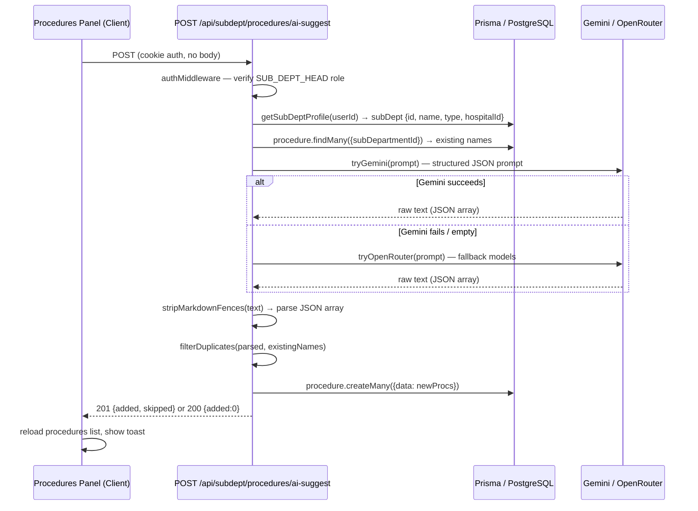

# Design Document: AI Auto-Add Procedures

## Overview

This feature adds a single-click "AI Auto-Add" button to the Procedures tab of the subdepartment dashboard. Clicking it calls a new API route that queries the subdepartment's context, builds a prompt, calls the Gemini/OpenRouter AI infrastructure, parses the response, deduplicates against existing procedures, and bulk-inserts the results. The user sees a live loading state and a success/error message after completion.

The implementation touches two layers:
- **API**: a new Next.js App Router route `POST /api/subdept/procedures/ai-suggest`
- **UI**: additions to the existing procedures panel in `src/app/subdept/dashboard/page.tsx`

No new dependencies are required. The feature reuses the existing `authMiddleware`, `getSubDeptProfile`, `prisma`, `successResponse`/`errorResponse`, and the Gemini/OpenRouter fetch pattern from `/api/chat/route.ts`.

---

## Architecture



The API route is self-contained — it does not call any existing service layer function for the AI step, keeping the AI logic co-located with the route (matching the pattern in `/api/chat/route.ts` and `/api/blogs/generate`).

---

## Components and Interfaces

### 1. API Route — `src/app/api/subdept/procedures/ai-suggest/route.ts`

**Method**: `POST`  
**Auth**: `SUB_DEPT_HEAD` role required (403 otherwise)  
**Request body**: none (context derived from session)

**Response shapes**:

```typescript
// 201 — procedures inserted
{ success: true, message: string, data: { added: number, skipped: number } }

// 200 — nothing new to add
{ success: true, message: string, data: { added: 0, skipped: number } }

// 403 — wrong role
{ success: false, message: "Forbidden" }

// 502 — AI returned unparseable response
{ success: false, message: "AI returned an invalid response. Please try again." }

// 500 — DB error
{ success: false, message: "Failed to save procedures" }
```

**Internal helpers** (module-scoped, not exported):

```typescript
function buildProcedurePrompt(
  deptType: string,
  deptName: string,
  existingNames: string[]
): string

function stripFences(text: string): string
// Removes ```json ... ``` or ``` ... ``` wrappers

function tryGemini(prompt: string): Promise<string | null>
// POST to generativelanguage.googleapis.com — same pattern as /api/chat/route.ts

function tryOpenRouter(prompt: string): Promise<string | null>
// Iterates OPENROUTER_MODELS — same pattern as /api/chat/route.ts
```

### 2. UI Changes — `src/app/subdept/dashboard/page.tsx`

New state variables added to `SubDeptDashboardContent`:

```typescript
const [aiAdding, setAiAdding] = useState(false);
const [aiMsg, setAiMsg] = useState<{ type: "success" | "info" | "error"; text: string } | null>(null);
```

New handler:

```typescript
const handleAiAutoAdd = async () => { ... }
```

The Auto-Add button is rendered in the procedures toolbar alongside the existing "Add Procedure" and "Export" buttons. The feedback toast auto-dismisses after 5 seconds via `setTimeout`.

---

## Data Models

No schema changes are required. The feature writes to the existing `procedure` table using fields already present.

### Procedure record written by `createMany`

```typescript
{
  hospitalId:      string,   // from subDept profile
  subDepartmentId: string,   // from subDept profile
  name:            string,   // from AI response
  type:            ProcType, // one of the valid PROC_TYPES
  fee:             number | null,
  duration:        number | null,  // minutes
  description:     string | null,
  sequence:        0,        // default; user can reorder later
  isActive:        true,
}
```

### AI response schema (validated after parse)

```typescript
type AIProcedure = {
  name:        string;
  type:        "CONSULTATION" | "PROCEDURE" | "SURGERY" | "DIAGNOSTIC" | "THERAPY" | "VACCINATION" | "OTHER";
  fee:         number | null;
  duration:    number | null;
  description: string | null;
}
```

### Prompt structure

The prompt instructs the AI to return **only** a raw JSON array with no surrounding text:

```
You are a medical procedure catalog assistant.

Generate between 10 and 20 clinically appropriate procedures for a subdepartment with the following details:
- Department Type: {deptType}
- Department Name: {deptName}

Rules:
1. Return ONLY a raw JSON array. No explanation, no markdown, no code fences.
2. Each object must have exactly these fields:
   - "name": string (procedure name)
   - "type": one of CONSULTATION, PROCEDURE, SURGERY, DIAGNOSTIC, THERAPY, VACCINATION, OTHER
   - "fee": number in Indian Rupees (INR), or null
   - "duration": number in minutes, or null
   - "description": short string (1-2 sentences), or null
3. Assign realistic INR fee values appropriate for the procedure type and Indian private clinic context.
4. Assign realistic duration values in minutes.
5. Do NOT include any of these already-existing procedures: {existingNames.join(", ")}

Return the JSON array now:
```

---

## Correctness Properties

*A property is a characteristic or behavior that should hold true across all valid executions of a system — essentially, a formal statement about what the system should do. Properties serve as the bridge between human-readable specifications and machine-verifiable correctness guarantees.*

### Property 1: Duplicate-free insertion

*For any* set of existing procedure names and any list of AI-generated procedure suggestions, the filtered result passed to `createMany` must contain no entry whose `name` matches any existing name (case-insensitive). This also implies that when every suggestion is a duplicate, zero rows are inserted.

**Validates: Requirements 3.1, 3.3**

---

### Property 2: Added + skipped = total valid AI suggestions

*For any* valid AI response containing N structurally valid procedure objects, the sum of `added` and `skipped` returned by the API must equal N.

**Validates: Requirements 3.4**

---

### Property 3: Fence stripping preserves JSON equivalence

*For any* valid JSON array, wrapping it in markdown code fences (` ```json ... ``` ` or ` ``` ... ``` `) and then applying `stripFences` must produce a string that parses to a value deeply equal to the original array. Applying `stripFences` to a string with no fences must return an equivalent string.

**Validates: Requirements 2.8**

---

### Property 4: All inserted procedures have valid PROC_TYPES

*For any* AI response, every procedure object that passes the duplicate filter must have its `type` coerced to one of the seven valid values — `CONSULTATION`, `PROCEDURE`, `SURGERY`, `DIAGNOSTIC`, `THERAPY`, `VACCINATION`, `OTHER` — before insertion. No row with an invalid type may reach the database.

**Validates: Requirements 5.5**

---

### Property 5: UI loading state is always cleared after completion

*For any* outcome of the `handleAiAutoAdd` handler — successful insertion, zero-add, 502 error, 500 error, or network throw — the `aiAdding` state must be `false` after the handler settles, and the Auto-Add button must not remain disabled.

**Validates: Requirements 1.4, 4.4**

---

### Property 6: Prompt always contains subdepartment context

*For any* subdepartment type and name, the string returned by `buildProcedurePrompt` must contain the department type, the department name, and the list of existing procedure names (or an indication that none exist).

**Validates: Requirements 2.4, 5.1**

---

### Property 7: Non-SUB_DEPT_HEAD callers always receive 403

*For any* authenticated request where the caller's role is not `SUB_DEPT_HEAD`, the API must return a 403 response and must not perform any database reads or AI calls.

**Validates: Requirements 2.2**

---

### Property 8: Malformed AI response always produces 502

*For any* string returned by the AI service that cannot be parsed as a JSON array (after fence stripping), the API must return a 502 response and must not attempt a database write.

**Validates: Requirements 2.7**

---

## Error Handling

| Scenario | Behaviour |
|---|---|
| Non-`SUB_DEPT_HEAD` caller | `403 Forbidden` |
| `getSubDeptProfile` throws (user has no linked subdept) | `404` from service error, propagated |
| Gemini API key missing or request fails | Falls through to OpenRouter |
| OpenRouter all models fail | Returns `502` with descriptive message |
| AI returns non-JSON or malformed JSON | `stripFences` + `JSON.parse` throws → `502` |
| AI returns JSON but items have wrong shape | Items with invalid `type` are coerced to `"OTHER"`; items missing `name` are dropped |
| `prisma.procedure.createMany` throws | `500` with error logged; no partial commit (Prisma `createMany` is atomic) |
| All suggestions are duplicates | `200` with `added: 0`, no DB write |
| UI fetch fails (network error) | `aiMsg` set to error, `aiAdding` cleared |

---

## Testing Strategy

### Unit tests

Focus on the pure functions and specific examples:

- `stripFences`: input with ` ```json ` fences, plain ` ``` ` fences, no fences, leading/trailing whitespace
- `buildProcedurePrompt`: verify output contains dept type, dept name, existing names, "10", "20", "INR", "minutes"
- Duplicate filter: exact match, case-insensitive match, no match, empty existing list
- AI response shape validation: missing `name` field (dropped), invalid `type` (coerced to `"OTHER"`)
- Gemini-first fallback: mock Gemini to fail, assert OpenRouter is called (Requirement 2.5)
- DB error → 500: mock `createMany` to throw, assert 500 response (Requirement 3.5)
- Auto-dismiss: fake timers, assert `aiMsg` is null after 5000ms (Requirement 4.5)
- Button click sends correct fetch: simulate click, assert `POST /api/subdept/procedures/ai-suggest` (Requirement 2.1)

### Property-based tests

Use **fast-check** (`npm install --save-dev fast-check`). Each test runs a minimum of **100 iterations**.

Tag format: `// Feature: ai-auto-add-procedures, Property {N}: {property_text}`

**Property 1 — Duplicate-free insertion**
```typescript
// Feature: ai-auto-add-procedures, Property 1: Duplicate-free insertion
fc.assert(fc.property(
  fc.array(fc.string()),
  fc.array(aiProcedureArb()),
  (existing, suggestions) => {
    const filtered = filterDuplicates(suggestions, existing);
    const existingLower = new Set(existing.map(n => n.toLowerCase()));
    return filtered.every(p => !existingLower.has(p.name.toLowerCase()));
  }
), { numRuns: 100 });
```

**Property 2 — Added + skipped = total**
```typescript
// Feature: ai-auto-add-procedures, Property 2: Added + skipped = total valid AI suggestions
fc.assert(fc.property(
  fc.array(fc.string()),
  fc.array(aiProcedureArb()),
  (existing, suggestions) => {
    const filtered = filterDuplicates(suggestions, existing);
    return filtered.length + (suggestions.length - filtered.length) === suggestions.length;
  }
), { numRuns: 100 });
```

**Property 3 — Fence stripping preserves JSON equivalence**
```typescript
// Feature: ai-auto-add-procedures, Property 3: Fence stripping preserves JSON equivalence
fc.assert(fc.property(
  fc.array(aiProcedureArb()),
  fc.constantFrom("```json\n", "```\n", ""),  // fence prefix
  (procedures, prefix) => {
    const json = JSON.stringify(procedures);
    const fenced = prefix ? `${prefix}${json}\n\`\`\`` : json;
    const stripped = stripFences(fenced);
    return JSON.stringify(JSON.parse(stripped)) === JSON.stringify(JSON.parse(json));
  }
), { numRuns: 100 });
```

**Property 4 — All inserted procedures have valid PROC_TYPES**
```typescript
// Feature: ai-auto-add-procedures, Property 4: All inserted procedures have valid PROC_TYPES
const VALID_TYPES = ["CONSULTATION","PROCEDURE","SURGERY","DIAGNOSTIC","THERAPY","VACCINATION","OTHER"];
fc.assert(fc.property(
  fc.array(aiProcedureArb()),   // may include invalid types
  fc.array(fc.string()),
  (suggestions, existing) => {
    const filtered = filterDuplicates(suggestions, existing);
    const normalized = normalizeTypes(filtered);
    return normalized.every(p => VALID_TYPES.includes(p.type));
  }
), { numRuns: 100 });
```

**Property 5 — UI loading state always cleared**
```typescript
// Feature: ai-auto-add-procedures, Property 5: UI loading state is always cleared after completion
// Tested via React Testing Library with mocked fetch returning each possible outcome:
// success 201, zero-add 200, 502, 500, network throw.
// For each: assert aiAdding === false after handler settles.
```

**Property 6 — Prompt always contains subdepartment context**
```typescript
// Feature: ai-auto-add-procedures, Property 6: Prompt always contains subdepartment context
fc.assert(fc.property(
  fc.string({ minLength: 1 }),   // deptType
  fc.string({ minLength: 1 }),   // deptName
  fc.array(fc.string()),         // existingNames
  (deptType, deptName, existingNames) => {
    const prompt = buildProcedurePrompt(deptType, deptName, existingNames);
    return prompt.includes(deptType) && prompt.includes(deptName);
  }
), { numRuns: 100 });
```

**Property 7 — Non-SUB_DEPT_HEAD callers always receive 403**
```typescript
// Feature: ai-auto-add-procedures, Property 7: Non-SUB_DEPT_HEAD callers always receive 403
// Tested as an integration test: for each role in [HOSPITAL_ADMIN, DOCTOR, NURSE, RECEPTIONIST, ...],
// call the route handler with a mocked auth token and assert status 403.
```

**Property 8 — Malformed AI response always produces 502**
```typescript
// Feature: ai-auto-add-procedures, Property 8: Malformed AI response always produces 502
fc.assert(fc.property(
  fc.string().filter(s => { try { JSON.parse(s); return false; } catch { return true; } }),
  async (malformedText) => {
    // mock tryGemini to return malformedText, mock tryOpenRouter to return null
    const res = await callRouteHandler(malformedText);
    return res.status === 502;
  }
), { numRuns: 100 });
```
